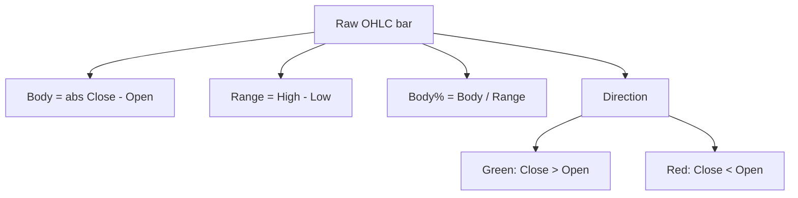
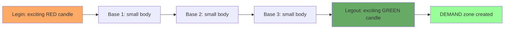
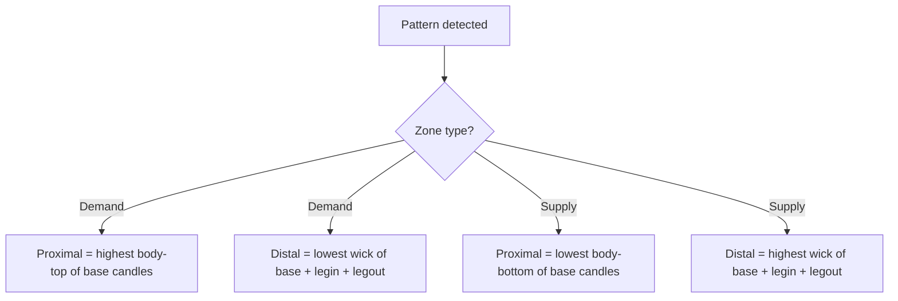
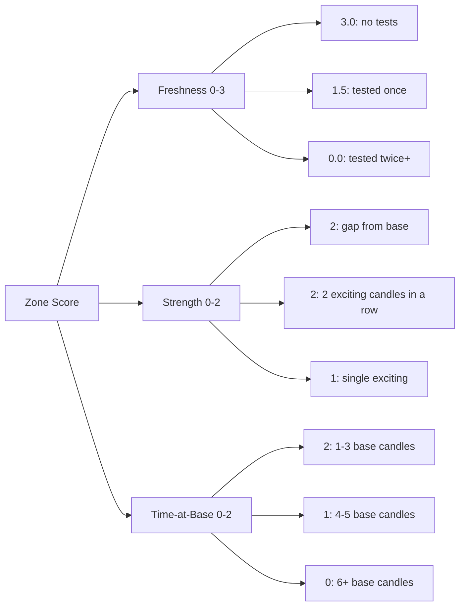
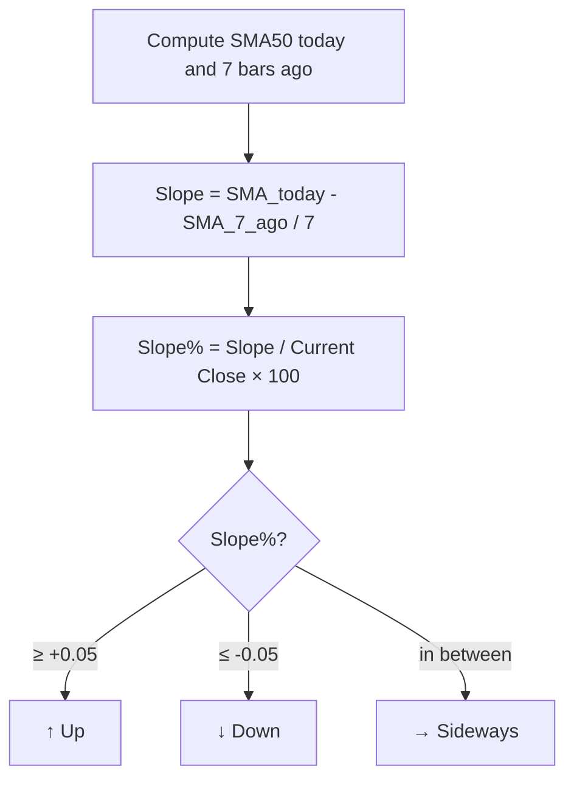
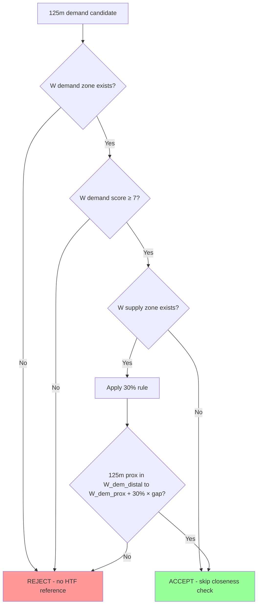
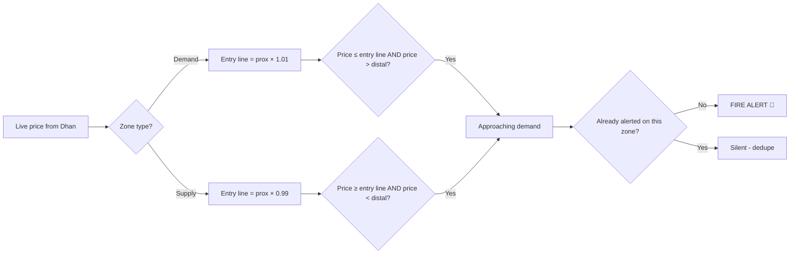

# Nifty Zone Scanner — Algorithm Reference

Quick reference for the core detection logic. Covers candle anatomy → zones →
scoring → trend → HTF distance → entry-line alerts.

---

## 1. Candle Anatomy

Every candle has 4 prices: **Open (O), High (H), Low (L), Close (C)**.



### Visual

```
            H ─────  ←  High of bar (top wick)
            │
        ┌───┴───┐
        │       │
        │ Body  │   ←  Open-to-Close rectangle
        │       │
        └───┬───┘
            │
            L ─────  ←  Low of bar (bottom wick)
```

### Example

| Bar | Open | High | Low | Close | Body | Range | Body% | Direction |
|-----|------|------|-----|-------|------|-------|-------|-----------|
| #1  | 100  | 105  | 99  | 104   | 4    | 6     | 67%   | Green     |
| #2  | 104  | 106  | 102 | 103   | 1    | 4     | 25%   | Red       |
| #3  | 103  | 108  | 103 | 107   | 4    | 5     | 80%   | Green     |

### Classification

```python
# scanner.py
EXCITE_PCT = 0.50   # body% threshold for "exciting" candles
BASE_PCT   = 0.50   # body% threshold for "base" candles

is_exciting = body_pct >= EXCITE_PCT   # large body, strong move
is_base     = body_pct <  BASE_PCT     # small body, consolidation
```

Bar #1 (67%): **Exciting** → potential legin or legout
Bar #2 (25%): **Base** → consolidation
Bar #3 (80%): **Exciting** → potential legin or legout

---

## 2. Zone Pattern: legout → bases → legin

A zone forms when there's a strong move OUT of a small consolidation that
followed a strong move INTO it.



### The walk

Scanner walks backwards from the most recent confirmed candle:

```
TIME →
... [Legin] [Base] [Base] [Base] [Legout] [Today]
     RED     small  small  small  GREEN

If legout is green + legin is red → DBR pattern → DEMAND zone
If legout is red + legin is green → RBD pattern → SUPPLY zone
If both same color → continuation pattern (RBR or DBD)
```

### Code segment

```python
# scanner.py detect_zones()
for start_bar in range(1, LOOKBACK_BARS + 1):
    # 1. Is this candle an "exciting" legout?
    if body_pct_at(start_bar) < EXCITE_PCT:
        continue

    # 2. Walk backwards through base candles
    base_cnt = 0
    ii = start_bar + 1
    while base_cnt < MAX_BASE and is_base_at(ii):
        base_cnt += 1
        ii += 1

    # 3. The candle just past bases is the legin
    if base_cnt >= 1 and is_exciting_at(ii):
        # Pattern found!
        create_zone(...)
```

---

## 3. Zone Boundaries (Body-to-Wick Marking)

Once a pattern is detected, the zone has two edges:



### Visual: Demand Zone

```
PRICE ↑
              ← Current price (above the zone)
              
   ┌─────────────────────┐  ← Proximal (entry edge)
   │   DEMAND ZONE       │     = highest body of bases
   │                     │
   │                     │
   └─────────────────────┘  ← Distal (stop-loss edge)
                              = lowest wick

TIME →
```

### Example

```
Bases formed at:
  Bar #2: O=100, C=98   (body: 98-100)
  Bar #3: O=99,  C=101  (body: 99-101)
  Bar #4: O=100, C=99   (body: 99-100)

Highest body of any base = max(100, 101, 100) = 101  ← Proximal
Lowest wick (low) = min(low_2, low_3, low_4) = 96     ← Distal

Demand zone: 96 (distal) ↔ 101 (proximal)
```

### Code

```python
# Body-to-Wick marking (Pine default)
if zone_type == "demand":
    proximal = max(body_high of all bases)
    distal   = min(low of all bases + legin + legout)
else:  # supply
    proximal = min(body_low of all bases)
    distal   = max(high of all bases + legin + legout)
```

---

## 4. Score Calculation (max 7.0)

Each zone gets a score from 0-7 based on three factors:



### Formula

```
Total Score = Freshness + Strength + Time-at-Base
```

### Example calculations

**Premium zone (score 7.0):**
- Fresh, never tested → Freshness = 3.0
- Legout gapped from base → Strength = 2.0
- 2 base candles → Time-at-Base = 2.0
- **Total: 7.0** ⭐

**Mediocre zone (score 4.0):**
- Tested once → Freshness = 1.5
- Single exciting legout → Strength = 1.0
- 3 base candles → Time-at-Base = 2.0
- Wait, that's 4.5. Let me redo.
- Tested twice → Freshness = 0.0
- 5 base candles → Time-at-Base = 1.0
- 2 exciting candles → Strength = 2.0
- Wait that's 3.0. Hmm.
- Let's just say: Fresh (3.0) + Single exciting (1.0) + 6 bases (0.0) = 4.0

### Code segment

```python
# scanner.py detect_zones()
# Freshness component
if tests == 0: f_score = 3.0
elif tests == 1: f_score = 1.5
else: f_score = 0.0

# Strength component
is_gap = (legout_open > base_high) if zone_type == "demand" else (legout_open < base_low)
next_candle_exciting = nx_body_pct >= EXCITE_PCT
s_score = 2 if is_gap else (2 if next_candle_exciting else 1)

# Time-at-Base component
t_score = 2 if base_cnt <= 3 else (1 if base_cnt <= 5 else 0)

score = f_score + s_score + t_score   # max 7.0
```

---

## 5. Trend Calculation (50 SMA Slope)

Direction over time is measured by the slope of the 50-period SMA over the last 7 bars.



### Visual

```
PRICE ↑          SMA-50 (red dashed)
       │           ╱
       │         ╱    ← Slope going up
       │       ╱      
       │     ╱        ← 7 bars ago
       │   ╱          
       │ ╱            
       └────────────────→ TIME

Slope per bar = (SMA_today - SMA_7_ago) / 7
Slope %       = Slope / Current_Close × 100
Threshold     = ±0.05%
```

### Example

```
Current Close   = 2475.30
SMA50 today     = 2450.10
SMA50 7 bars ago = 2420.50

Slope/bar = (2450.10 - 2420.50) / 7 = 4.23
Slope %   = 4.23 / 2475.30 × 100 = 0.171%

0.171% > 0.05% → Trend = Up ↑
```

### Code

```python
# scanner.py compute_trend()
sma_today      = df["Close"].rolling(50).mean().iloc[-1]
sma_7_bars_ago = df["Close"].rolling(50).mean().iloc[-8]
close_now      = df["Close"].iloc[-1]

slope_pct = (sma_today - sma_7_bars_ago) / 7 / close_now * 100

if slope_pct > 0.05:    return 1   # Up
elif slope_pct < -0.05: return -1  # Down
else:                   return 0   # Side
```

---

## 6. HTF Confluence — "30% Rule" for 125m

When scanning 125m, the alert needs HTF (Weekly) zone confluence.



### The 30% rule visualized

```
PRICE ↑

   Weekly Supply zone   ┌──────────┐  300-350
                        │          │
                        └──────────┘
                                          ← gap = 100 (W_sup_prox - W_dem_prox)
                                          ← 30% of gap = 30
   Allowed range for    ┌──────────┐  ← upper limit: W_dem_prox + 30 = 230
   125m demand prox     │          │
                        │   150 - 230  ← valid range
                        │          │
   Weekly Demand zone   ┌──────────┐  ← lower limit: W_dem_distal = 150
                        │          │
                        └──────────┘  150-200

TIME →
```

### Example

```
W demand:   distal=150, proximal=200
W supply:   proximal=300, distal=350
Gap:        300 - 200 = 100
30% gap:    30

For 125m DEMAND alert:
  Valid range = [150, 200 + 30] = [150, 230]

  125m prox = 175 → INSIDE W demand → ✓ ACCEPT
  125m prox = 220 → within 30% of W demand → ✓ ACCEPT
  125m prox = 260 → too far from W demand → ✗ REJECT
```

### Code

```python
# scanner.py passes_125m_strict_filter()
if zone_type == "demand":
    if trend_htf_daily != 1: return False             # D trend must be Up
    if w_dem is None or w_dem["score"] < 7: return False
    if w_sup is None: return True                     # skip closeness if no W supply

    gap = w_sup["proximal"] - w_dem["proximal"]
    threshold = 0.30 * gap                            # 30% rule
    lo = w_dem["distal"]
    hi = w_dem["proximal"] + threshold

    return lo <= ltf_zone["proximal"] <= hi
```

---

## 7. Entry-Line Crossing (Alert Trigger)

The alert fires when current price crosses an "entry line" near the zone proximal.



### Visual

```
PRICE ↑                      
                              
    ╲                          ← Current price falling
     ╲                          
      ╲   ┄┄┄┄┄┄┄┄┄┄┄┄┄┄┄┄┄  ← Entry line (Proximal × 1.01)
       ╲                        ← Alert fires HERE
        ┌─────────────────┐  ← Proximal
        │  DEMAND ZONE    │
        │                 │
        └─────────────────┘  ← Distal
                              
TIME →
```

### Code

```python
# scanner.py is_approaching()
if zone["type"] == "demand":
    entry = zone["proximal"] * (1 + ALERT_ENTRY_PCT/100)   # 1.01 for 1%
    return close_now <= entry and close_now > zone["distal"]
else:  # supply
    entry = zone["proximal"] * (1 - ALERT_ENTRY_PCT/100)   # 0.99 for 1%
    return close_now >= entry and close_now < zone["distal"]
```

---

## 8. Complete Data Flow

How all pieces connect during one scan iteration:

```mermaid
sequenceDiagram
    participant Loop as loop_scan.py
    participant Cache as ohlc cache (in-memory)
    participant Dhan as Dhan API
    participant Detect as detect_zones()
    participant Filter as passes_*_filter()
    participant TG as Telegram

    Loop->>Cache: Load cached OHLC for 1d, 1wk, 125m
    Loop->>Dhan: fetch LTPs for 500 stocks
    Dhan-->>Loop: 500 live prices

    loop For each stock × each timeframe
        Loop->>Detect: detect_zones(df with patched LTP)
        Detect-->>Loop: best demand & supply zone

        alt zone is approaching entry line
            Loop->>Filter: passes_strict_filter (or 125m variant)
            alt filter passes
                Loop->>TG: send alert
            end
        end
    end

    Note over Loop: sleep 30 sec, repeat
```

---

## 9. Quick reference: file locations

| File | Purpose |
|------|---------|
| `scanner.py` | Core detection logic (`detect_zones`, `compute_trend`, strict filters) |
| `loop_scan.py` | Long-running session orchestrator + iteration loop |
| `refresh_dhan_token.py` | Daily Dhan token rotation |
| `symbols.py` | Nifty 500 ticker list |
| `build_dhan_map.py` | Generates symbol → Dhan security_id mapping |
| `dhan_security_ids.json` | The mapping (committed to repo) |
| `state_*.json` | Per-timeframe alert dedupe state |

---

## 10. Configuration cheat sheet

All from `scan.yml` env vars:

| Variable | Default | What it does |
|----------|---------|--------------|
| `TIMEFRAMES` | `1d,1wk,125m` | Which timeframes to scan |
| `ALERT_ENTRY_PCT` | `1.0` | How far above/below proximal the entry line sits |
| `ALERT_MIN_SCORE` | `7.0` | Minimum zone score to trigger alert |
| `STRICT_FILTER` | `true` | Apply HTF trend + zone confluence checks |
| `TF_125M_CLOSENESS_PCT` | `0.30` | 30% rule threshold for 125m/W confluence |
| `POLL_SECONDS` | `30` | How often to fetch Dhan LTPs |
| `CACHE_REFRESH_MINS` | `60` | How often to refresh yfinance cache |
| `ALERT_CHANNEL` | `telegram` | Where alerts go: `telegram` / `email` / `both` |

---

## 11. Alert channels (Telegram + Email)

The scanner can deliver alerts via Telegram, email, or both. Switching is a
single env-var change in `scan.yml`:

```yaml
ALERT_CHANNEL: 'email'      # SMTP only (use during Telegram restrictions)
ALERT_CHANNEL: 'telegram'   # Telegram only (default)
ALERT_CHANNEL: 'both'       # Send to both in parallel (paranoid mode)
```

The `dispatch_alert()` function in `scanner.py` routes each alert to the
configured channel(s). Telegram + email logic is independent — if one fails,
the other still goes.

### Telegram setup (existing — no change)

Requires GH Actions secrets `TG_TOKEN`, `TG_CHAT_ID`. Telegram caption cap is
1024 chars; when chart is attached, the Gemini LLM thesis is dropped if the
combined caption would exceed that cap.

### Email setup (Gmail SMTP)

One-time setup:

1. **Enable 2FA on your Google account** (required for App Passwords).
2. **Generate a Gmail App Password** at
   <https://myaccount.google.com/apppasswords>. This 16-char password is
   separate from your regular Gmail password — use it only here.
3. **Add three GH Actions secrets**:
   | Secret | Value |
   |--------|-------|
   | `SMTP_USER` | Your Gmail address, e.g. `yourname@gmail.com` |
   | `SMTP_PASS` | The 16-char App Password from step 2 |
   | `EMAIL_TO`  | One OR MORE recipients, comma-separated. Examples: `you@gmail.com` or `you@gmail.com,friend@gmail.com,spouse@gmail.com`. All recipients see each other in the To: header. |
4. **Flip `ALERT_CHANNEL` to `email`** in `scan.yml` and push.

Defaults: `SMTP_HOST=smtp.gmail.com`, `SMTP_PORT=587` (TLS). Override via env
if using a different provider.

Email has no caption-length limit, so the FULL alert (zone details + LLM
thesis) is always sent. The chart PNG is attached inline so it renders in the
email body.
